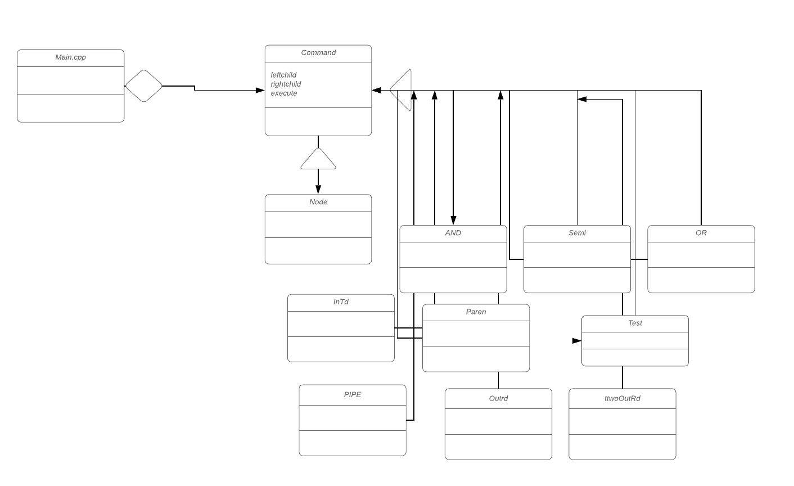

# CS 100 Programming Project

# Introduction/Updates
* We are creating an Rshell that can take in command line inputs and excute the commands the user wants.
* The shell is now able to handle parenthesis and check to see if a file or direcotry exists. 
* The shell will be able to interpret the user input and push it through the appropiate classes in order to execute the command properly.
* The executable file can be any program located at a given path.
# Updates for assignment 4:
* The Rshell can now redirect input and out put of files into different files
* The rshell is able to run commands and then put the output of them into a different file
* The Rshell is able to basically switch the contents of one file to another by redirecting the input and the output.
* We were able to parse the objects correctly and we able to work with the persmissions of the files
* We updated our CMAKELISTS file in order to work with the autograder.
* Our program also works with the past implementions of other assignments. 

  
# Diagram

# Classes
We are going to be using 6 different classes within our R Shell project. These classes are going to be the command, node, semi, and, and or classes. 

###### Main
* Main class is responsibe for the executable and running the whole show. 
###### Node
* Node class completes parsing and executes commands using recursion and depends on connector types

###### Command
* Command class is our base class.  Node, and. or, and semi inherit from Command.
###### InRD
* InRD class handles input redirection to different files
###### OutRD
* OutRD class handles output redirection to different files
###### TwoOutRD
* TwoOutRd class handles outs redirection to different files
###### Pipe
* Pipe class handles the piping of a class
###### Paren
* The paren class handles if there was a parenthesis written in the input and excutes that first over other executables

###### Test
* The test class was made to handle the checking of if a file exists and it could run different processes based of the flags it encountered.

###### AND
* The and class will handle the case of the process involving two inputs that are if and only if

###### OR
* The or class will handle the case of the process in involving thwo inputs that are connected through or.
###### Semi
* Semi class handles the semicolon connector and executes based on the position of the semicolon object in the tree.

# Prototypes/Research:
We updated the parse to build the tree correctly with the new redirectio noperators. This was a challenge but we were able to still use the Command class in order to maintain the integretiy of the class. We implemented the parenthesis by using parse recursivly to call parse and include the branch that it made to the tree above. This allowed us to use the same structure when executing with left and right childs. We implemented the flags by having a test.hpp files that would recieve a string that it would parse itself inside of the class and parse thorugh it to get the flag and execuetable part. We fixed issues we had with our Command classes so we would have the correct boolean to work off of. After experimenting with execvp(), waitpid(), and fork(), I found that fork is used to create 2 processes, a parent process and a child process, that run concurrently.  Fork will be useful in our assignment for running multiple commands at the same time and allowing us to utilize the connectors.  Execvp() is used to execute commands that the use inputs.  We can read user input into an array and use these arrays in the paramaters of Execvp() to execute commands given in the command line by users.  Waitpid() is used to stop a certain process that was made using fork.  Eech process has a PID that can be use to identify a specific process, which is used in the paramater of waitpid().  This function will be used when we want to stop a specific process at any point in the program. Our parsing prototype will read input from the user and store it in an array of characters, taking note of connectors such as ";", "||", and "&&".  With this input, a command given by the user will be executed using execvp().  When using connectors, ";" is used to chain different commands, "&&" is used to execute multiple commands, and "||" executes the first command that does not fail.

# Development and Testing Roadmap
We are using the kaban strategy in order to get the work necessary done because the project has a clear sequential ordering of things to do. We are using the project board inside of github to keep track of the tasks we need to do. We will be updating the to do list as the assignments come in. We are using different test files that connect via unit test to execute the test to show that the program is working properly 

